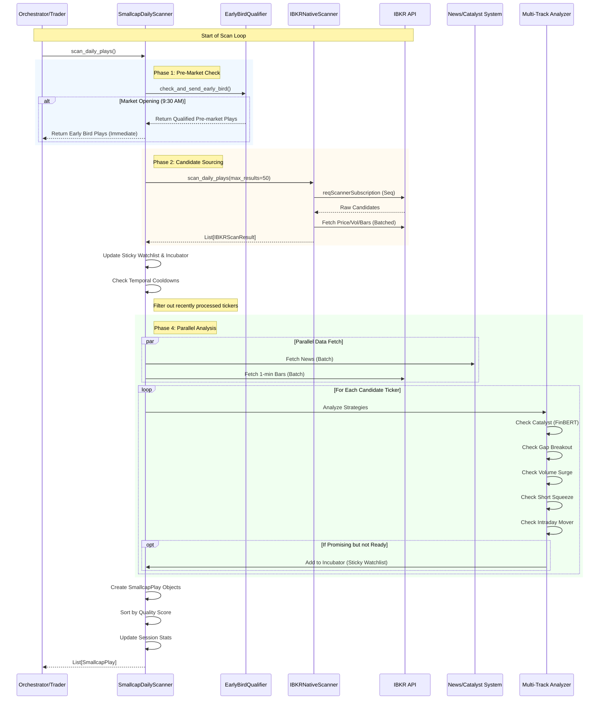

# Scanner Module Analysis & Architecture

This document provides a detailed analysis of the `scanner` module in `trading_system_v3`, specifically focusing on the `SmallcapDailyScanner` and its interaction with `IBKRNativeScanner`.

## 1. High-Level Architecture

The scanning system is designed as a two-layer architecture:

1.  **Orchestration Layer (`SmallcapDailyScanner`)**:
    *   Manages the business logic for finding trading opportunities.
    *   Handles news analysis (`CatalystAnalyzer`).
    *   Applies multi-strategy logic (finding Gaps, Volume Surges, Catalyst plays, etc. on the same ticker).
    *   Manages "Sticky Watchlists" and Temporal Re-analysis (cooldowns).
    *   **Goal**: Return high-quality `SmallcapPlay` objects to the trading engine.

2.  **Data Layer (`IBKRNativeScanner`)**:
    *   Direct interface with Interactive Brokers.
    *   Executes raw market scans (e.g., "Top % Gainers", "Most Active").
    *   Handles low-level data fetching (Price, Volume, Historical Bars).
    *   Manages subscriptions (`BatchPriceManager`) to ensure real-time data.
    *   **Goal**: Provide raw, enhanced market candidates.

## 2. Core Components

### A. SmallcapDailyScanner (`scanner/smallcap/smallcap_daily_scanner.py`)
The brain of the operation. It runs on a loop (externally controlled) and performs the following:
*   **Early Bird Qualifier**: Checks for opportunities during pre-market (8:00 - 9:30 AM).
*   **Multi-Track Analysis**: Analyzes a single ticker for *multiple* potential strategies simultaneously (e.g., a stock can be both a `GAP_BREAKOUT` and have `CATALYST_NEWS`).
*   **Parallelization**: Fetches news and 1-minute bars for all candidates in parallel to minimize latency.

### B. IBKRNativeScanner (`scanner/ibkr_native_scanner.py`)
The muscle. It replaces the old ProRealTime integration.
*   **Adaptive Caching**: Adjusts data refresh rates based on market activity.
*   **Rate & Error Handling**: Manages IBKR API limits (e.g., Pacing violations) by executing scans sequentially with delays, but fetching data in batches.

### C. OpportunityTracker (`scanner/opportunity_tracker.py`)
The memory.
*   Prevents spamming the same signal repeatedly.
*   Only allows re-sending a signal if substantial changes occur (e.g., Sentiment shift, 50% volume increase, Price breakout).

## 3. Detailed Workflow Diagram

The following Mermaid diagram illustrates the complete lifecycle of a scan iteration.

## 4. Key Logic & Optimizations

### 1. Parallelization
The system heavily utilizes `asyncio.gather` in `_create_multi_track_opportunities` to fetch:
*   News headlines for all ~50 candidates at once.
*   One-minute historical bars for all candidates at once.
*   **Result**: Reduces analysis time from ~3 minutes to ~30 seconds.

### 2. Multi-Track Analysis
Instead of running separate scanners for "Gap Up" and "Volume Surge", the `IBKRNativeScanner` fetches a broad list of "Active & Moving" stocks. The `SmallcapDailyScanner` then checks each stock against **all** strategies.
*   *Example*: A stock found via "Most Active" scan can generate both a `VOLUME_SURGE` play and a `CATALYST_NEWS` play if it has breaking news.

### 3. "Sticky" Watchlist (Incubator)
If a stock looks interesting (e.g., Price > VWAP) but doesn't trigger a signal immediately, it is added to a local `sticky_watchlist`.
*   **Benefit**: Even if the stock drops out of IBKR's "Top 50" list on the next scan, the scanner *manually* fetches it (`fetch_specific_tickers`) to keep tracking it.

### 4. Implicit & Explicit Event Detection
*   **Explicit**: Uses FinBERT to find "FDA Approval" or "Merger" news.
*   **Implicit (Optional)**: Can detect "Events" purely based on price/volume anomalies if news is slow (`ImplicitEventDetector`).
